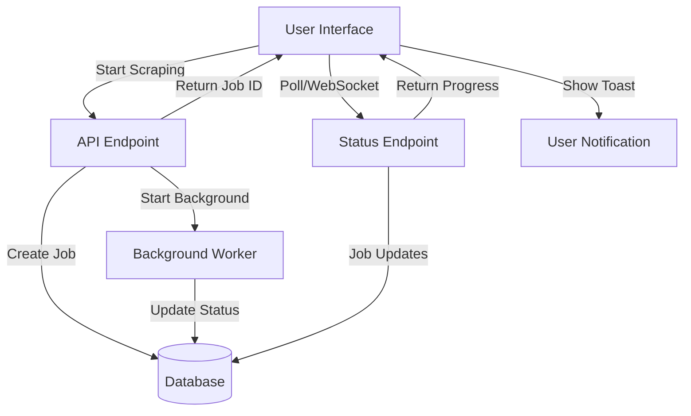

# Background Scraping System - Implementation Plan

## Overview
Transform the blocking scraping dialog into a professional background task system with real-time notifications and progress tracking.

---

## Architecture Overview



---

## Phase 1: Database Schema

### New Model: `ScrapingJob`

**File**: `app/models/ScrapingJob.ts`

```typescript
interface ScrapingJob {
  _id: ObjectId
  communityId: ObjectId
  companyName: string
  status: 'pending' | 'in_progress' | 'completed' | 'failed'
  progress: number (0-100)
  totalPlans: number
  scrapedPlans: number
  startedAt: Date
  completedAt?: Date
  error?: string
  createdBy: ObjectId
  createdAt: Date
  updatedAt: Date
}
```

**Fields**:
- `communityId`: Reference to community
- `companyName`: Company being scraped
- `status`: Current job status
- `progress`: Percentage complete (0-100)
- `totalPlans`: Total number of plans found
- `scrapedPlans`: Number of plans scraped so far
- `error`: Error message if failed
- `createdBy`: User who initiated the scraping

**Indexes**:
- `{ status: 1, createdAt: -1 }` - For active jobs
- `{ createdBy: 1, status: 1 }` - For user's jobs
- `{ communityId: 1 }` - For community jobs

---

## Phase 2: API Endpoints

### 1. Start Scraping (Non-blocking)

**Endpoint**: `POST /api/scraping/start`

**Request**:
```json
{
  "communityId": "123",
  "companyName": "Example Homes"
}
```

**Response** (Immediate):
```json
{
  "success": true,
  "jobId": "job_123",
  "message": "Scraping started for Example Homes"
}
```

**Logic**:
1. Validate inputs
2. Create ScrapingJob record (status: 'pending')
3. Return job ID immediately
4. Trigger background worker (async, no await)

---

### 2. Job Status

**Endpoint**: `GET /api/scraping/status/:jobId`

**Response**:
```json
{
  "jobId": "job_123",
  "status": "in_progress",
  "progress": 45,
  "totalPlans": 20,
  "scrapedPlans": 9,
  "companyName": "Example Homes",
  "startedAt": "2024-01-15T10:00:00Z"
}
```

---

### 3. Active Jobs (for navbar badge)

**Endpoint**: `GET /api/scraping/active`

**Response**:
```json
{
  "activeJobs": [
    {
      "jobId": "job_123",
      "companyName": "Example Homes",
      "progress": 45,
      "status": "in_progress"
    }
  ],
  "count": 1
}
```

**Logic**:
- Return jobs with status 'pending' or 'in_progress'
- Filter by current user (or all for admins)

---

### 4. Job History

**Endpoint**: `GET /api/scraping/history?page=1&limit=10`

**Response**:
```json
{
  "jobs": [...],
  "total": 50,
  "page": 1,
  "totalPages": 5
}
```

---

### 5. Retry Failed Job

**Endpoint**: `POST /api/scraping/retry/:jobId`

---

## Phase 3: Background Worker

### Implementation Approach

**File**: `app/lib/scrapingWorker.ts`

**Options**:

#### Option A: Simple Async (Current Setup)
```typescript
export async function startScrapingJob(jobId: string) {
  // Run scraping in background
  // Update job status and progress in DB
  // No blocking of API response
}
```

#### Option B: Queue System (Recommended for Production)
- Use **BullMQ** or **Agenda** for job queue
- Better for scaling and handling failures
- Automatic retries
- Job prioritization

**For MVP**: Use Option A (simple async)

**Worker Logic**:
1. Update job status to 'in_progress'
2. Perform scraping with progress updates
3. For each plan scraped:
   - Increment `scrapedPlans`
   - Update `progress` percentage
   - Save to DB
4. On completion:
   - Update status to 'completed'
   - Set `completedAt` timestamp
5. On error:
   - Update status to 'failed'
   - Store error message

---

## Phase 4: Frontend Components

### 1. Navbar Badge & Dropdown

**Component**: `app/components/ActiveTasksDropdown.tsx`

**Features**:
- Badge showing count of active jobs
- Dropdown with list of active jobs
- Progress bars for each job
- Click to view details
- Animated badge on updates

**UI Design**:
```
┌─────────────────────────────┐
│  🔄 Active Tasks (2)        │
├─────────────────────────────┤
│  Example Homes              │
│  ████████░░ 75%             │
│                             │
│  Builder Co                 │
│  ████░░░░░░ 30%             │
├─────────────────────────────┤
│  View All Tasks →           │
└─────────────────────────────┘
```

---

### 2. Update Manage Page

**File**: `app/manage/page.tsx`

**Changes**:
1. Remove blocking dialog
2. On "Add Company":
   - Call `/api/scraping/start`
   - Show success toast
   - Store job ID
3. Optional: Show inline progress for recent additions

---

### 3. Task Manager Page (Admin)

**File**: `app/admin/tasks/page.tsx`

**Features**:
- Table of all scraping jobs
- Filters: Status, Date, User
- Search by company name
- Actions: View details, Retry
- Real-time status updates

**Columns**:
- Company Name
- Community
- Status Badge
- Progress Bar
- Started At
- Duration
- Initiated By
- Actions

---

## Phase 5: Real-time Updates

### Approach: Client-side Polling

**Implementation**:

```typescript
// Custom hook
function useScrapingJobs() {
  const [activeJobs, setActiveJobs] = useState([])
  
  useEffect(() => {
    const interval = setInterval(async () => {
      const response = await fetch('/api/scraping/active')
      const data = await response.json()
      setActiveJobs(data.activeJobs)
      
      // Check for completed jobs and show toast
      checkForCompletions(data.activeJobs)
    }, 3000) // Poll every 3 seconds
    
    return () => clearInterval(interval)
  }, [])
  
  return activeJobs
}
```

**Why Polling**:
- Simpler to implement
- No WebSocket infrastructure needed
- Good enough for this use case (jobs take minutes)

**Alternative** (Future Enhancement):
- Server-Sent Events (SSE)
- WebSocket for instant updates

---

## Phase 6: Notifications

### Toast Notifications

**Events**:
1. **Job Started**: 
   - "✓ Scraping started for [Company]"
   - Variant: success

2. **Job Completed**:
   - "✅ Scraping completed for [Company]"
   - "Added X plans to [Community]"
   - Variant: success

3. **Job Failed**:
   - "❌ Scraping failed for [Company]"
   - Show error details
   - Variant: destructive
   - Action: "Retry" button

---

## Implementation Order

### Sprint 1: Core Infrastructure (2-3 days)
- [ ] Create ScrapingJob model
- [ ] Implement `/api/scraping/start` endpoint
- [ ] Implement `/api/scraping/status` endpoint
- [ ] Create background worker function
- [ ] Update existing scraping logic to use worker

### Sprint 2: Active Jobs UI (1-2 days)
- [ ] Implement `/api/scraping/active` endpoint
- [ ] Create ActiveTasksDropdown component
- [ ] Add badge to Navbar
- [ ] Create useScrapingJobs hook with polling
- [ ] Integrate toast notifications

### Sprint 3: Manage Page Integration (1 day)
- [ ] Update AddCompanyModal to use new API
- [ ] Remove blocking dialog
- [ ] Add success/error handling
- [ ] Test complete flow

### Sprint 4: Admin Task Manager (2 days)
- [ ] Create `/admin/tasks` page
- [ ] Implement job history endpoint
- [ ] Add filters and search
- [ ] Implement retry functionality
- [ ] Add real-time updates to table

### Sprint 5: Polish & Testing (1 day)
- [ ] Error handling improvements
- [ ] Loading states
- [ ] Edge cases testing
- [ ] Performance optimization
- [ ] Documentation

---

## File Structure

```
app/
├── models/
│   └── ScrapingJob.ts                    # New model
├── lib/
│   ├── scrapingWorker.ts                 # Background worker
│   └── scrapingHelpers.ts                # Helper functions
├── api/
│   └── scraping/
│       ├── start/
│       │   └── route.ts                  # Start job
│       ├── status/
│       │   └── [jobId]/route.ts          # Get status
│       ├── active/
│       │   └── route.ts                  # Active jobs
│       ├── history/
│       │   └── route.ts                  # Job history
│       └── retry/
│           └── [jobId]/route.ts          # Retry job
├── components/
│   ├── ActiveTasksDropdown.tsx           # Navbar dropdown
│   └── ScrapingJobCard.tsx               # Job display card
├── hooks/
│   └── useScrapingJobs.ts                # Real-time jobs hook
└── admin/
    └── tasks/
        ├── page.tsx                      # Task manager page
        └── components/
            ├── JobsTable.tsx             # Jobs table
            ├── JobFilters.tsx            # Filters
            └── JobActions.tsx            # Action buttons
```

---

## Technical Considerations

### 1. Concurrent Jobs
- Limit: Max 3 concurrent scraping jobs per user
- Queue additional requests
- Show warning if limit reached

### 2. Job Cleanup
- Auto-delete completed jobs after 7 days
- Keep failed jobs for 30 days
- Configurable retention policy

### 3. Error Handling
- Network errors: Auto-retry (max 3 attempts)
- Rate limiting: Exponential backoff
- Invalid data: Mark as failed, log details

### 4. Performance
- Index optimization for queries
- Pagination for job history
- Limit polling frequency (3-5 seconds)

### 5. Security
- Validate user permissions
- Rate limit API endpoints
- Sanitize company names
- CSRF protection

---

## Success Metrics

1. **User Experience**:
   - Zero blocking operations
   - Clear progress visibility
   - Timely notifications

2. **Performance**:
   - API response < 200ms (job creation)
   - Polling overhead < 5% CPU
   - No memory leaks

3. **Reliability**:
   - 95%+ successful scraping rate
   - Automatic recovery from failures
   - No lost jobs

---

## Future Enhancements

### Phase 2 Features:
1. **WebSocket Support**: Real-time updates
2. **Job Prioritization**: Admin priority queue
3. **Batch Operations**: Scrape multiple companies
4. **Scheduling**: Schedule scraping at specific times
5. **Notifications**: Email/SMS for long-running jobs
6. **Analytics**: Job success rates, average duration
7. **Export**: Download job reports
8. **Webhooks**: Notify external systems

---

## Testing Plan

### Unit Tests:
- ScrapingJob model validation
- API endpoint responses
- Worker function logic
- Helper functions

### Integration Tests:
- Full scraping flow
- Concurrent job handling
- Error scenarios
- Notification delivery

### E2E Tests:
- User starts scraping
- Navigate during scraping
- Receive completion notification
- View job history

---

## Documentation

### User Guide:
- How to start scraping
- Understanding job status
- Viewing active tasks
- Managing failed jobs

### Developer Guide:
- API documentation
- Worker architecture
- Adding new scraping sources
- Debugging jobs

---

## Rollout Plan

### Phase 1: Beta (Internal Testing)
- Deploy to staging
- Test with small dataset
- Gather feedback
- Fix critical bugs

### Phase 2: Soft Launch
- Enable for admin users only
- Monitor performance
- Collect metrics
- Iterate on UX

### Phase 3: Full Launch
- Enable for all users
- Comprehensive documentation
- Support training
- Monitoring dashboard

---

## Estimated Timeline

- **Total Duration**: 7-10 days
- **Core Infrastructure**: 2-3 days
- **UI Components**: 2-3 days
- **Admin Features**: 2 days
- **Testing & Polish**: 2 days

**Team**: 1-2 developers

---

## Questions to Consider

1. Should regular users see all jobs or only their own?
2. What's the max allowed concurrent scraping jobs?
3. How long should we keep completed jobs?
4. Should we send email notifications for long-running jobs?
5. Do we need job prioritization (admin vs regular users)?

---

## Next Steps

1. **Review this plan** with the team
2. **Confirm requirements** and priorities
3. **Set up project board** with tasks
4. **Start with Phase 1** (database + API)
5. **Iterate and improve** based on feedback
